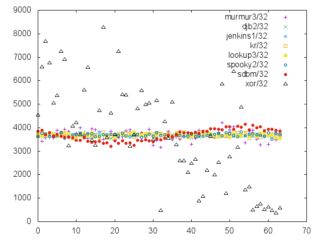
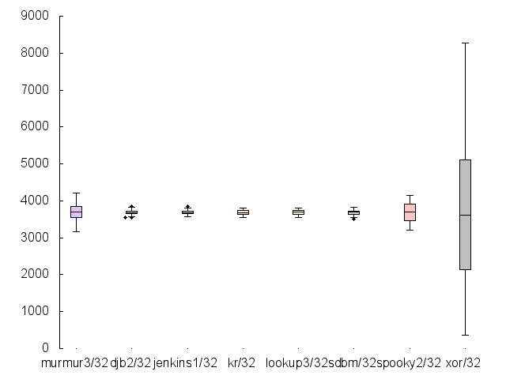
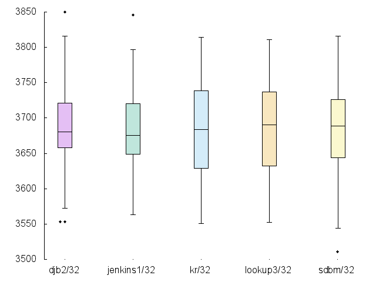
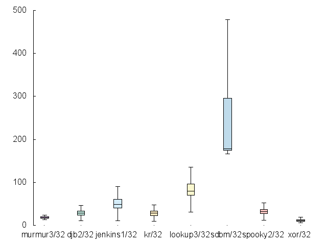
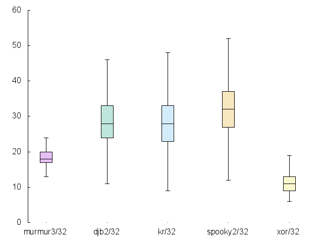

jhunt/hash
==========

Hashing.  It's one of _the fundamentals_ of Computer Science, but
how do you compare the **performance** of a given hash function to
another?

Here, you will find my attempts at solving that problem for
multiple personal projects.  I'm not (currently) in the business
of defining new hashing algorithms, so it just focuses on hash
functions built by smarter people than me, and attempts to portray
their behavior and performance characteristics.

Above all, this _test suite_ strives to be flexible, enabling new
tests corpora to be integrated with minimal effort.

I hope you find this useful.

Fitness Tests
-------------

In order to gauge the _fitness_ of a particular hash function, we
can check _simple uniformity_, or how evenly the algorithm
distributes output values.  A hash function that always returns
the value `42` is decidedly non-uniform.

_Simple_ uniformity must be differentiated from _random_
uniformity.  For simple uniformity, we don't care how random the
distribution appears, we just care that it is even.  Random
uniformity has important implications for
_cryptographically-secure_ hashing functions, but for simple hash
tables (my original problem space) it may not be worth the effort.

### Results

Hashing ~235k English words over 64 bins (calculated `H(s) % 64`),
we can look at the scatter plot of bin clustering to get a gut
feel for how uniform each hash is:

Yeesh.  XOR looks terrible, but that's not unexpected.  The rest
all seem to cluster around the middle (which is good!), so let's
look at a consolidated boxplot to get a feel for quartile
distribution:

As before, XOR is off the charts, and makes it difficut to see the
relative differences between the other, more serious hashing
algorithms.  If we drop the worst three (murmur3/32, spooky2/32,
and xor/32), the picture gets a little clearer:

Timing Benchmarks
-----------------

We also need to evaluate each hash algorithm according to how long
it take to perform hashing operations.  To do that, we average the
execution times of fifty runs of the hash function against each
string in our training corpus.  This set of per-operation
durations is graphed below as a boxploy:

The y-axis is measured in nanoseconds.

SDBM/32 has pretty dismal performance (75th percentile is no
better than ~200ns/op and can get as high as ~300ns/op) compared
to all the others.  If we drop the worst three (sdbm/32,
lookup3/32, and jenkins1/32), we can see more nuance between the
top performers:

Incidentally, XOR has the best timing performance.  Given that
it's a single assembly instruction per byte, that's not too
surprising.

Conclusion
----------

DJB2 hash really comes out on top, given it's low time cost per
hashing operation, and high simple uniformity.  This is based on
single-word English text.  Other corpora may show different
results, since hashing is highly dependent on the input keys.
