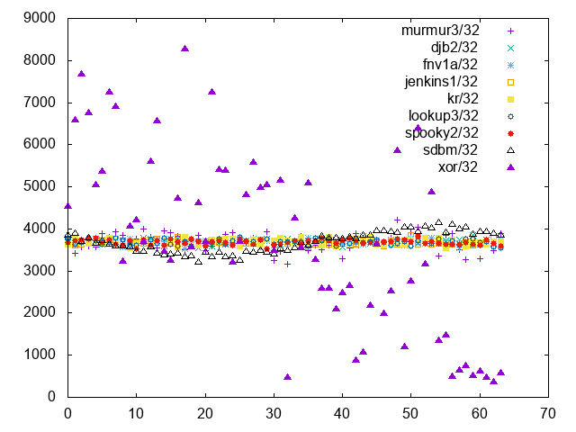
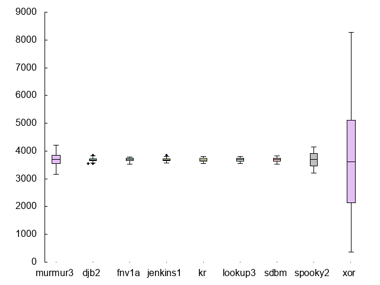
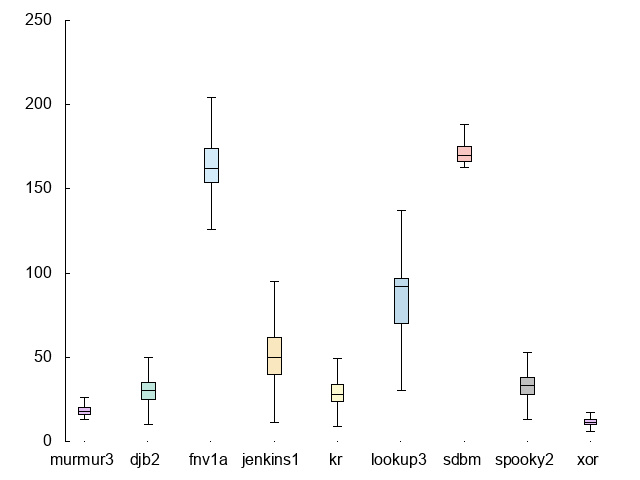
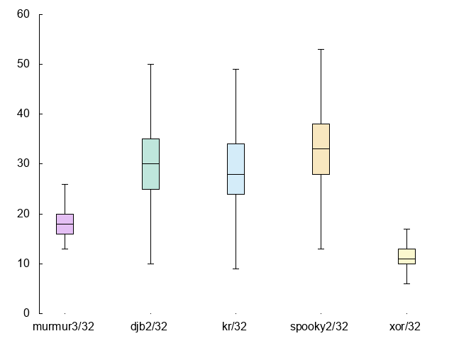
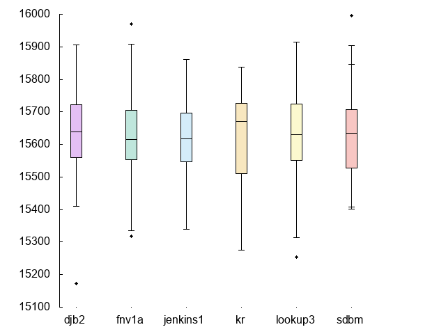
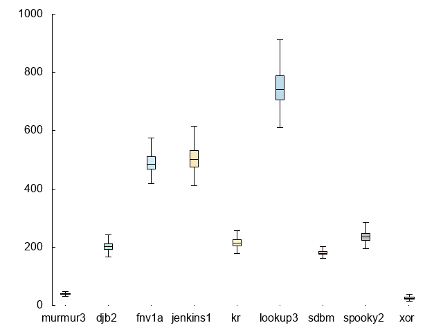
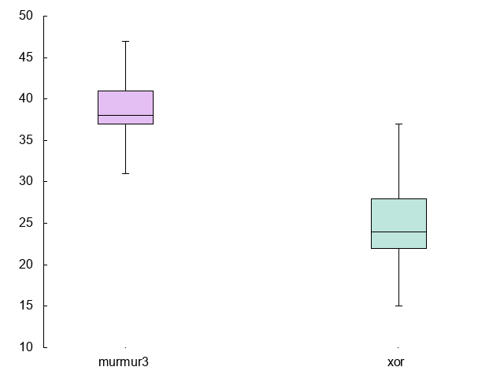

jhunt/hash
==========

Hashing.  It's one of _the fundamentals_ of Computer Science, but
how do you compare the **performance** of a given hash function to
another?

Here, you will find my attempts at solving that problem for
multiple personal projects.  I'm not (currently) in the business
of defining new hashing algorithms, so it just focuses on hash
functions built by smarter people than me, and attempts to portray
their behavior and performance characteristics.

Above all, this _test suite_ strives to be flexible, enabling new
tests corpora to be integrated with minimal effort.

I hope you find this useful.

Fitness Tests
-------------

In order to gauge the _fitness_ of a particular hash function, we
can check _simple uniformity_, or how evenly the algorithm
distributes output values.  A hash function that always returns
the value `42` is decidedly non-uniform.

_Simple_ uniformity must be differentiated from _random_
uniformity.  For simple uniformity, we don't care how random the
distribution appears, we just care that it is even.  Random
uniformity has important implications for
_cryptographically-secure_ hashing functions, but for simple hash
tables (my original problem space) it may not be worth the effort.

### Results

Hashing ~235k English words over 64 bins (calculated `H(s) % 64`),
we can look at the scatter plot of bin clustering to get a gut
feel for how uniform each hash is:

Yeesh.  xor looks terrible, but that's not unexpected.  The rest
all seem to cluster around the middle (which is good!), so let's
look at a consolidated boxplot to get a feel for quartile
distribution:

As before, xor is off the charts, and makes it difficut to see the
relative differences between the other, more serious hashing
algorithms.  If we drop the worst three (murmur3/32, spooky2/32,
and xor/32), the picture gets a little clearer:

Timing Benchmarks
-----------------

We also need to evaluate each hash algorithm according to how long
it take to perform hashing operations.  To do that, we average the
execution times of fifty runs of the hash function against each
string in our training corpus.  This set of per-operation
durations is graphed below as a boxplot:

The y-axis is measured in nanoseconds.

SDBM/32 has pretty dismal performance (75th percentile is no
better than ~200ns/op and can get as high as ~300ns/op) compared
to all the others.  If we drop the worst three (sdbm/32,
lookup3/32, and jenkins1/32), we can see more nuance between the
top performers:

Incidentally, xor has the best timing performance.  Given that
it's a single assembly instruction per byte, that's not too
surprising.

Testing Qualified Names
-----------------------

Before I started playing with hash functions just for the hell of
it, I found myself in search of a good hashing function for
[bolo-ng][bolo] and [TSDP][tsdp] qualified names.

Qualified Names look like this:

    host=web01.example.com, metric=cpu, value=0.001, ts=1474055418

That is, a set of `key=value` pairs, separated by commas.  This is
definitely _not_ English text, so let's re-run the fitness tests
and timing benchmarks against a corpus of dummy qualified names.

(Side note: I wrote a small Perl script, [madlibs][madlibs],
that let me easily generate hundreds of thousands of test names.
:+1:)

Fitness Tests (Qualified Names Edition)
---------------------------------------

Hashing 100k Qualified Names over 64 bins (again calculated as
`H(s) % 64`), we can look at the scatter plot of bin clustering to
get a gut feel of uniformity given our new inputs:

Not much has changed; xor/32 is still terrible.  Let's look at the
box plots:

We knew xor/32 was bad, but now we can also see that murmur2/32 is
worse than the others, so let's drop those two out and hopefully
get a better picture of the top performers:

Timing Benchmarks (Qualified Names Edition)
-------------------------------------------

With the longer strings in the Qualified Names corpus, let's see
what happens with the performance.  Again, we're going to average
the execution times of fifty runs of the hash function against
each string in the corpus.  This set of per-operation durations is
graphed below as a boxplot:

The y-axis is meaured in nanoseconds.

It seems quite clear that we have three "bands" of performance;
murmur3 and xor are the fastest, followed by djb2, k&r, sdbm and
spooky2 in the mid-range, with jenkins1 and lookup3 bringing up
the rear as the slowest.

Let's focus on the middle tier:

djb2/32 is the clear winner with the least variation and the
quickest median per-hash execution speed at a little over 200ns.

But why settle for the middle-tier when we have two candidates for
super-ultra-fast:

xor/32 sure is fast.  But so is murmur3/32, clocking in at a
little under 40ns, 5x faster than djb2/32.

Conclusion
----------

For my purposes, djb2/32 and murmur3/32 are the two best options.
**Two** best options?  Isn't that a cop-out?  Not really.  I'll
probably be going with djb2/32 when I need uniformity, and
murmur3/32 for raw speed of hashing.

[bolo]:    https://github.com/jhunt/bolo-ng
[tsdp]:    https://github.com/bolo/rfc/blob/master/draft-hunt-tsdp-00.txt
[madlibs]: https://github.com/jhunt/madlibs
